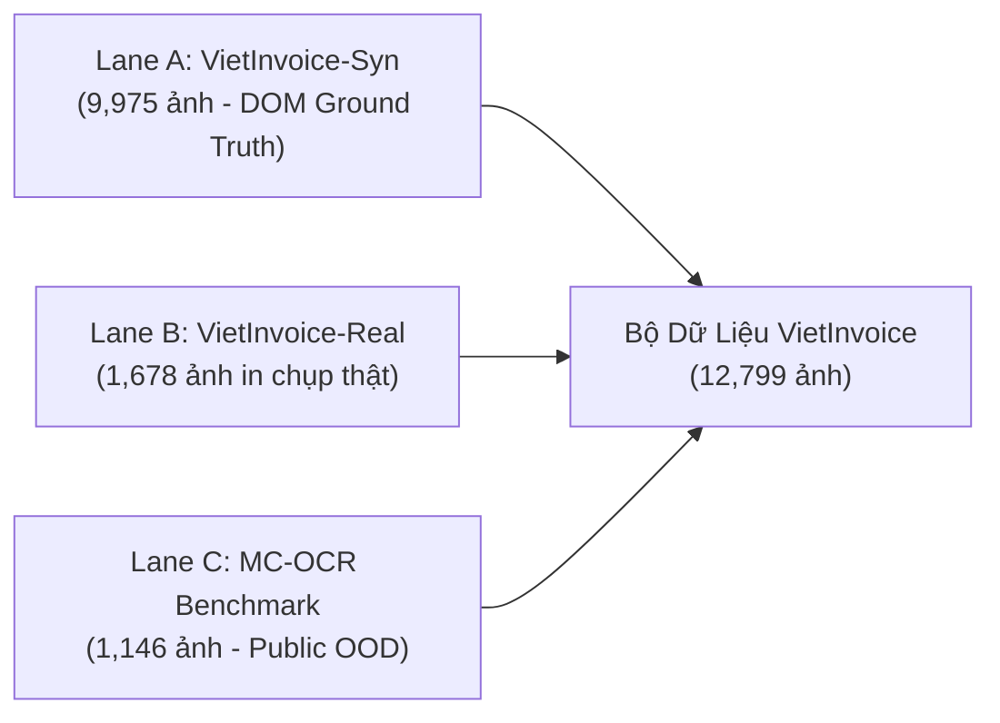

# TÀI LIỆU TỔNG HỢP TOÀN DIỆN VÀ CHUYÊN SÂU BẢO VỆ KHÓA LUẬN TỐT NGHIỆP
## HỆ THỐNG PHÂN TÍCH BỐ CỤC VÀ TRÍCH XUẤT THÔNG TIN CHÍNH TỪ HÓA ĐƠN VÀ BIÊN LAI TIẾNG VIỆT (AVIR-KIE)
*(Phiên bản Master Encyclopedia - Đầy đủ Công thức Toán học, Mổ xẻ Mã nguồn, Phân tích Phần cứng và Bộ Câu hỏi Phản biện Chuyên sâu)*

---

## MỤC LỤC CHI TIẾT
1. [Thông tin Hành chính & Hồ sơ Đề tài](#chương-1-thông-tin-hành-chính--hồ-sơ-đề-tài)
2. [Bối cảnh Thực tế & Nỗi đau Doanh nghiệp](#chương-2-bối-cảnh-thực-tế--nỗi-đau-doanh-nghiệp)
3. [Bước ngoặt Đề tài: The Big Pivot Story](#chương-3-bước-ngoặt-đề-tài-the-big-pivot-story)
4. [Cơ sở Lý thuyết Mạng Nơ-ron & Toán học Chuyên sâu](#chương-4-cơ-sở-lý-thuyết-mạng-nơ-ron--toán-học-chuyên-sâu)
   * 4.1. Bốn thế hệ của Document AI
   * 4.2. Tại sao chọn Qwen3-VL-8B?
   * 4.3. Quá trình Token hóa & Nén không gian của ViT
   * 4.4. Toán học của 2D M-RoPE (Multimodal Rotary Position Embedding)
   * 4.5. Cơ chế DeepStack Vision & Grouped Query Attention (GQA)
   * 4.6. LayerNorm vs BatchNorm & Biến thể RMSNorm
   * 4.7. Bản chất của Bộ ba Attention ($Q, K, V$) trên Hóa đơn
   * 4.8. Hàm kích hoạt GeLU vs SwiGLU / ReLU / Sigmoid
   * 4.9. Lượng tử hóa NF4 (4-bit NormalFloat)
   * 4.10. Lượng tử hóa kép (Double Quantization) & Tại sao chọn Khối 256?
   * 4.11. Các định dạng số thực (FP32, FP16, BF16, FP8)
   * 4.12. Phân tích Độ trễ 8.25s: Prefill Stage vs Decode Stage
5. [Kỹ thuật Huấn luyện QLoRA & Mổ xẻ Mã nguồn Training](#chương-5-kỹ-thuật-huấn-luyện-qlora--mổ-xẻ-mã-nguồn-training)
   * 5.1. Toán học của LoRA & Cách khởi tạo tránh Catastrophic Forgetting
   * 5.2. Mổ xẻ file `train_qwen3_vl_qlora_v2.py`
   * 5.3. Custom Loss Masking Collator (`QwenVLDataCollatorV2`)
   * 5.4. Bản chất của Optimizer `paged_adamw_8bit`
6. [Bộ Dữ liệu VietInvoice (12,799 Ảnh) & Pipeline Dán nhãn](#chương-6-bộ-dữ-liệu-vietinvoice-12799-ảnh--pipeline-dán-nhãn)
   * 6.1. Cấu trúc 3 phân vùng (Curriculum Learning)
   * 6.2. Phân chia Splits & Chống rò rỉ dữ liệu (Data Leakage)
   * 6.3. Sửa lỗi phần cứng máy ảnh: EXIF Orientation Transpose
7. [Kiến trúc Hệ thống Full-Stack & Kỹ thuật Phần mềm](#chương-7-kiến-trúc-hệ-thống-full-stack--kỹ-thuật-phần-mềm)
   * 7.1. Kiến trúc Microservice 3 tầng tách biệt
   * 7.2. Hot-swapping Adapter 0.00ms & Xả sạch VRAM 9.1MB trong 0.42s
   * 7.3. Mổ xẻ Thuật toán Hậu xử lý Gộp dòng (`reconcile_receipt_items`)
   * 7.4. Thuật toán Backtracking Shift cho Topping (`resolve_cascading_empty_amounts`)
   * 7.5. Kiểm chứng Số học Tài chính Tuyệt đối ($\Delta \le 1$ VNĐ)
   * 7.6. Phân tích Chi phí Kinh tế: On-premise GPU vs Cloud API (GPT-4o)
8. [Kết quả Thực nghiệm, Đo đạc & Phân tích Đột phá](#chương-8-kết-quả-thực-nghiệm-đo-đạc--phân-tích-đột-phá)
   * 8.1. Pha 1: Sàng lọc Zero-Shot 4 trường phái
   * 8.2. Pha 2: Đánh giá Mô hình Đề xuất & Ma trận Thực nghiệm $2 \times 2$
   * 8.3. F1 chi tiết 8 trường thực thể & Giải thích trường Đơn giá
   * 8.4. Đánh giá Ngoại miền Out-of-Domain trên MC-OCR
   * 8.5. Trả lời trọn vẹn 3 Câu hỏi Nghiên cứu (RQ1, RQ2, RQ3)
9. [Bộ 20 Câu hỏi Phản biện Hóc búa & Đáp án Điểm 10](#chương-9-bộ-20-câu-hỏi-phản-biện-hóc-búa--đáp-án-điểm-10)
10. [Kịch bản Thuyết trình Chuẩn 41 Slide (19 Phút)](#chương-10-kịch-bản-thuyết-trình-chuẩn-41-slide-19-phút)
11. [Bảng Tra cứu Số liệu Thần chú (Cheatsheet)](#chương-11-bảng-tra-cứu-số-liệu-thần-chú-cheatsheet)

---

## CHƯƠNG 1: THÔNG TIN HÀNH CHÍNH & HỒ SƠ ĐỀ TÀI

* **Tên đề tài tiếng Anh:** Deep Learning-based Layout Analysis and Key Information Extraction from Vietnamese Invoices and Receipts (**AVIR-KIE**)
* **Tên đề tài tiếng Việt:** Phân tích bố cục và trích xuất thông tin chính từ hóa đơn và biên lai tiếng Việt dựa trên học sâu
* **Mã đồ án:** GSU26AI50 | **Mã nhóm:** GSU26AI01
* **Giảng viên hướng dẫn:** Thầy **Nguyễn Hồng Hải** (`hainh51@fe.edu.vn`)
* **Thời gian & Địa điểm:** Học kỳ Summer 2026, Trường Đại học FPT Phân hiệu TP. Hồ Chí Minh

### Phân công vai trò & Trách nhiệm cá nhân:
1. **Hà Minh Dũng (Leader - SE183973):** Điều phối toàn diện tiến độ dự án, thiết kế kiến trúc hệ thống, xây dựng cấu trúc nhãn dữ liệu chuẩn (Prompt v2 Schema), trực tiếp lập trình huấn luyện 4-bit QLoRA cho mô hình Qwen3-VL, viết Custom Collator, lập trình API Gateway FastAPI và GPU Worker.
2. **Nguyễn Phước Đại (Member - SE180018):** Nghiên cứu các giải pháp tiền xử lý và tăng cường dữ liệu (Hardcore Augmentation), triển khai và đo lường các mô hình baseline so sánh (DeepSeek-OCR + Regex, DeepSeek-OCR + Qwen2.5-7B, MiniCPM-V 2.6).
3. **Nguyễn Thị Mỹ Cẩm (Member - SE172627):** Tổ chức thu thập và in ấn dữ liệu thực tế (Print & Capture từ 14 chuỗi thương hiệu), đo đạc profiler tài nguyên phần cứng (VRAM allocation, độ trễ suy luận, dòng điện), lập trình giao diện người dùng Next.js 14 Web Dashboard.
4. **Nguyễn Khắc Vương (Member - SE183769):** Thiết kế bộ công cụ đánh giá tự động (Evaluation Harness), lập trình mã nguồn đo đạc Macro-F1, Exact Match, Line Item Recall / Precision, trực tiếp phân tích ma trận thực nghiệm $2 \times 2$ Ablation và đánh giá ngoại miền OOD trên MC-OCR.

---

## CHƯƠNG 2: BỐI CẢNH THỰC TẾ & NỖI ĐAU DOANH NGHIỆP

### 2.1. Nỗi đau thực tế trong doanh nghiệp (Business Pain Points)
* Theo khảo sát tài chính doanh nghiệp bán lẻ và F&B tại Việt Nam, quy trình nhập liệu chứng từ mua bán, hóa đơn VAT và biên lai máy POS vẫn phụ thuộc nặng nề vào con người. Một nhân viên kế toán trung bình mất từ **2 đến 3 phút** để gõ lại thông tin của một tờ hóa đơn siêu thị có 15–20 mặt hàng vào phần mềm kế toán.
* Chi phí nhập liệu thủ công này chiếm **10–15% tổng chi phí vận hành kế toán**. 
* Nguy hiểm hơn, vào các đợt cao điểm quyết toán thuế và chốt sổ cuối tháng, sự mệt mỏi của con người dẫn đến tỷ lệ gõ sai số tiền từ **3% đến 5%**, gây hậu quả nghiêm trọng về mặt phạt thuế và sai lệch báo cáo tài chính.

### 2.2. Bốn thách thức vật lý của hóa đơn Việt Nam
1. **Tỷ lệ khung hình cực dọc (Extreme Aspect Ratio):** Hóa đơn giấy in nhiệt cuộn (thermal POS roll) khổ 57mm hoặc 80mm có chiều dài gấp **3 đến 10 lần** chiều rộng (ví dụ $1500 \times 250$ pixel). Nếu dùng các mô hình nén ảnh vuông cổ điển (ép về $448 \times 448$ px), các ký tự sẽ bị bóp nát bẹp, làm mất hoàn toàn hình dạng chữ in kim.
2. **Chất lượng in nhiệt xuống cấp (Physical Degradation):** Công nghệ in nhiệt ma trận điểm (dot-matrix) rất nhạy cảm với nhiệt độ và thời gian; sau vài tuần, mực in bắt đầu phai mờ, đứt nét. Khi chụp bằng camera điện thoại, ảnh bị méo phối cảnh (perspective distortion 10–25 độ), nhăn nheo, bóng đổ bàn tay và ánh sáng phòng loang lổ.
3. **Độ nhạy cảm của dấu thanh tiếng Việt:** Tiếng Việt có hệ thống nguyên âm phức tạp với các dấu phụ (ă, â, đ, ê, ô, ơ, ư) và 5 dấu thanh (huyền, sắc, hỏi, ngã, nặng). Một ký tự bị mờ dấu như *"Sữa Tươi Tiệt Trùng"* biến thành *"Sua Tuoi"* sẽ làm sai lệch danh mục hàng hóa trong kho.
4. **Cấu trúc bảng hàng hóa bất quy tắc:** Tên sản phẩm dài bị in tràn xuống dòng thứ 2 hoặc thứ 3, các dòng giảm giá (discount) hoặc ghi chú topping (như *"thêm trân châu"*) nằm lửng lơ bên dưới, và đặc biệt **trong 32% đến 48% hóa đơn F&B tại Việt Nam, khi khách mua 1 sản phẩm, máy in hoàn toàn không in cột đơn giá**, chỉ in cột thành tiền.

---

## CHƯƠNG 3: BƯỚC NGOẶT ĐỀ TÀI: THE BIG PIVOT STORY

### 3.1. Sự thất bại của Pipeline 2 giai đoạn truyền thống (Tuần 2 – 4)
Trong 4 tuần đầu tiên, nhóm tiếp cận bài toán theo lối mòn của các nghiên cứu trước đây:
$$\text{Ảnh Hóa đơn} \xrightarrow{\text{CRAFT}} \text{Bounding Boxes} \xrightarrow{\text{VietOCR}} \text{Văn bản thô} \xrightarrow{\text{PhoBERT / LayoutLMv3}} \text{Gán nhãn NER}$$

Nhóm nhận ra pipeline này có **hai lỗi chết người mang tính cấu trúc**:
1. **Lỗi lan truyền dây chuyền (Cascaded OCR Error Compounding):** 
   * Trên hóa đơn in nhiệt, khoảng cách dòng rất khít ($2 - 4$ mm). Mô hình phát hiện chữ CRAFT liên tục mắc lỗi dự đoán nhầm liên kết (affinity score), dẫn tới việc **gộp 2 dòng sản phẩm riêng biệt thành một Bounding Box duy nhất**.
   * Chữ in nhiệt bị đứt nét làm VietOCR đọc sai số tiền (ví dụ đọc số `39.000` thành `38.000` hoặc đọc nhầm dấu chấm ngăn cách ngàn thành dấu phẩy).
   * Khi bộ OCR ở tầng trước đã cắt sai khung hoặc đọc sai chữ, thông tin thị giác bị phá hủy vĩnh viễn. Các mô hình NLP phía sau (PhoBERT, LayoutLM) không có cách nào sửa chữa sai lầm này.
2. **Sự bế tắc của LayoutLMv3 khi trích xuất bảng (Row Clustering Defect):**
   * LayoutLMv3 chỉ là một mô hình phân loại token (Token Classification). Nó gán nhãn từng từ là `B-ITEM_NAME`, `I-ITEM_NAME`, `B-PRICE`...
   * Để ghép các token riêng lẻ này thành một bảng hàng hóa có dòng và cột hoàn chỉnh, kỹ sư bắt buộc phải viết các luật gom cụm hình học (Geometric Heuristic Heuristics). Khi hóa đơn bị cong, nhăn, nghiêng, các luật gióng hàng tọa độ này lập tức sụp đổ.

### 3.2. Lỗi Lệch Mảng Song Song (Parallel-Array Desynchronisation) của Prompt v1
Trong các thiết kế trước đây khi dùng mô hình VLM, các tác giả thường yêu cầu mô hình sinh ra 4 mảng phẳng song song:
```json
{
  "ITEM_NAME":   ["Trà Sen Vàng (L)", "Bánh Mì Thịt Nướng", "Phin Sữa Đá"],
  "ITEM_PRICE":  ["45.000", "39.000"],
  "ITEM_AMOUNT": ["45.000", "39.000", "39.000"]
}
```
* **Lỗ hổng:** Món *"Bánh Mì Thịt Nướng"* không in đơn giá $\rightarrow$ Mảng `ITEM_PRICE` chỉ có 2 phần tử, trong khi `ITEM_NAME` có 3 phần tử.
* **Hậu quả:** Khi hệ thống kế toán ghép nối theo chỉ mục (Index $i$):
  * Món 1 ($i=0$): Trà Sen Vàng $\rightarrow$ Giá 45.000 $\rightarrow$ Khớp.
  * Món 2 ($i=1$): Bánh Mì $\rightarrow$ Lấy phần tử thứ hai của mảng giá là **39.000** (thực chất là giá của Phin Sữa)!
  * Món 3 ($i=2$): Phin Sữa $\rightarrow$ Bị văng lỗi `IndexError: list index out of range` hoặc bị rỗng giá!
* Toàn bộ sổ cái hàng hóa bị trượt dòng hàng loạt.

### 3.3. Giải pháp Quyết định: End-to-End VLM + Prompt v2 (Cấu trúc Đối tượng Phân cấp)
* Nhóm đưa ra quyết định chuyển hướng chiến lược (Pivot): **Loại bỏ 100% các bộ OCR trung gian.** Chuyển sang mô hình Thị giác - Ngôn ngữ đầu-cuối (End-to-End VLM) **Qwen3-VL-8B**.
* Thiết kế **Prompt v2**: Đóng gói từng dòng hàng thành một đối tượng độc lập (Atomic Object):
  ```json
  "ITEMS": [
    {"name": "Trà Sen Vàng (L)", "qty": "1", "price": "", "amount": "45.000"},
    {"name": "Bánh Mì Thịt Nướng", "qty": "1", "price": "", "amount": "39.000"}
  ]
  ```
* Nếu không in đơn giá, mô hình điền chuỗi rỗng `""`. Trật tự dòng hàng được bảo toàn tuyệt đối, triệt tiêu 100% lỗi lệch mảng.

---

## CHƯƠNG 4: CƠ SỞ LÝ THUYẾT MẠNG NƠ-RON & TOÁN HỌC CHUYÊN SÂU

### 4.1. Bốn thế hệ của Document AI
```
Thế hệ 1: OCR + Regex (1990-2015) ────────> Cực kỳ cứng nhắc, đổi font là vỡ
Thế hệ 2: CRAFT + VietOCR + PhoBERT (2016-2020) ─> Lỗi lan truyền dây chuyền (Compound Error)
Thế hệ 3: LayoutLMv1-v3 (2020-2023) ───────> Phân loại token, phụ thuộc OCR bên ngoài
Thế hệ 4: End-to-End Generative VLM (2023-nay) ──> Đọc pixel -> Sinh JSON trực tiếp (AVIR-KIE)
```

### 4.2. Tại sao chọn Qwen3-VL-8B? (5 Lý do Vàng)
1. **Native Dynamic Patch Resolution:** Tự động điều chỉnh lưới patch theo tỷ lệ thật của ảnh, không ép ảnh thành hình vuông.
2. **2D Multimodal Rotary Position Embedding (2D M-RoPE):** Nhận thức không gian 2 chiều (dòng và cột).
3. **DeepStack Vision:** Đưa trực tiếp đặc trưng vi mô từ các tầng giữa của ViT vào LLM.
4. **Vốn từ vựng đa ngữ mạnh mẽ:** Nhận dạng chuẩn xác dấu tiếng Việt, không bị ảo giác chữ Hán như MiniCPM-V 2.6.
5. **Hiệu năng Zero-Shot số 1:** Bản Base đạt **86.89% Macro-F1**, bỏ xa đối thủ xếp sau tới gần 20%.

### 4.3. Quá trình Token hóa & Nén không gian của ViT
* Giả sử ảnh hóa đơn đầu vào có kích thước $(H, W, C)$.
* Bước 1: Resize bảo toàn tỷ lệ khung hình sao cho $\max(H, W) \le 1280$ px và $H \times W \le 602,112$ pixels.
* Bước 2: Chia ảnh thành các ô vuông cơ sở (Patches) kích thước $P \times P = 16 \times 16$ px. Số lượng patch thô:
  $$N_{\text{patches}} = \frac{H \times W}{16 \times 16}$$
* Bước 3: **Spatial Patch Merging ($2 \times 2$):** Cứ 4 patch liền kề ($2 \times 2$, tương đương vùng không gian $32 \times 32$ px) được ghép nối (concatenate) lại và chiếu qua một tầng tuyến tính để gộp thành **1 Visual Token duy nhất**:
  $$N_{\text{visual\_tokens}} = \frac{N_{\text{patches}}}{4} = \frac{H \times W}{32 \times 32}$$
* Ví dụ: Hóa đơn kích thước $416 \times 800$ px tạo ra 1,300 patches $\rightarrow$ nén lại chỉ còn **325 visual tokens**. Điều này giúp giảm độ phức tạp tính toán chú ý $\mathcal{O}(L^2)$ của LLM đi 16 lần!

### 4.4. Toán học của 2D M-RoPE (Multimodal Rotary Position Embedding)
Trong Transformer truyền thống, RoPE 1D mã hóa vị trí theo thứ tự tuần tự của từ:
$$R_{\Theta, m}^{1D} = \text{diag}\left(R_{\theta_1, m}, R_{\theta_2, m}, \dots, R_{\theta_{d/2}, m}\right)$$
Trong tài liệu hóa đơn, một từ không chỉ nằm trước hay sau, mà nó nằm ở **dòng bao nhiêu ($y$) và cột bao nhiêu ($x$)**. 
**2D M-RoPE của Qwen3-VL phân rã kênh nhúng vị trí thành 3 thành phần không - thời gian:**
$$\mathbf{p} = (t, y, x)$$
* $t$: Tọa độ thời gian (cho video hoặc thứ tự lượt hội thoại).
* $y$: Tọa độ dòng dọc (tương ứng với số hàng của bảng hóa đơn).
* $x$: Tọa độ cột ngang (tương ứng với cột Tên món, Số lượng, Đơn giá, Thành tiền).

Vector biểu diễn vị trí được chia làm 3 phần và nhân xoay ma trận độc lập:
$$\mathbf{q}_{\text{mrope}} = \left[ \mathbf{q}_{[0 : d/3]} R_{\Theta, t} \,\|\, \mathbf{q}_{[d/3 : 2d/3]} R_{\Theta, y} \,\|\, \mathbf{q}_{[2d/3 : d]} R_{\Theta, x} \right]$$
* **Ý nghĩa:** Khi tính tích vô hướng $Q \cdot K^T$, điểm số chú ý tự động đo được cả khoảng cách ngang (cùng một dòng hàng) và khoảng cách dọc (cùng một cột số liệu), mang lại khả năng gióng hàng bảng 2D vượt trội.

### 4.5. Cơ chế DeepStack Vision & Grouped Query Attention (GQA)
* **DeepStack:** Thông thường, các mô hình VLM chỉ lấy đặc trưng ở tầng cuối cùng của ViT đưa vào LLM. Nhược điểm: Tầng cuối chỉ giữ lại ngữ nghĩa trừu tượng, các nét chấm li ti của máy in nhiệt ma trận bị mất hết. Qwen3-VL trích xuất bản đồ đặc trưng ở **tầng 8, tầng 16, và tầng 24** của ViT, đưa thẳng và cộng gộp vào các **tầng 0, tầng 1, và tầng 2** của LLM. LLM vừa có cái nhìn tổng quan, vừa soi rõ từng nét mực mờ.
* **GQA (Grouped Query Attention):** Thay vì mỗi đầu Query có một đầu Key và Value riêng (MHA tốn rất nhiều VRAM cho KV Cache), Qwen3-VL dùng **32 Query Heads chia sẻ chung 8 Key-Value Heads** (tỷ lệ 4:1). Bộ nhớ KV Cache giảm 4 lần, cho phép sinh JSON mượt mà trên card 16GB.

### 4.6. LayerNorm vs BatchNorm & Biến thể RMSNorm
* **BatchNorm:** Tính trung bình $\mu_B$ và phương sai $\sigma_B^2$ theo chiều dọc của toàn bộ batch. Khi câu văn dài ngắn khác nhau hoặc khi suy luận từng ảnh một (`batch_size=1`), BatchNorm sụp đổ vì không có mẫu để tính phương sai.
* **LayerNorm:** Chuẩn hóa độc lập trên từng token đơn lẻ dọc theo các chiều ẩn (Hidden dimensions $d$):
  $$\mu = \frac{1}{d} \sum_{j=1}^d x_j, \quad \sigma^2 = \frac{1}{d} \sum_{j=1}^d (x_j - \mu)^2$$
  $$\hat{x} = \frac{x - \mu}{\sqrt{\sigma^2 + \epsilon}} \odot \gamma + \beta$$
* **RMSNorm (Root Mean Square Normalization - Dùng trong Qwen3-VL):** Nhận thấy việc trừ trung bình $\mu$ không đóng góp nhiều vào sự ổn định, RMSNorm lược bỏ hoàn toàn bước tính $\mu$, chỉ chia cho giá trị căn bậc hai trung bình bình phương:
  $$\text{RMS}(x) = \sqrt{\frac{1}{d} \sum_{j=1}^d x_j^2 + \epsilon}, \quad \hat{x} = \frac{x}{\text{RMS}(x)} \odot \gamma$$
  Giúp tăng tốc độ tính toán trên nhân Tensor Core của GPU lên **10% đến 15%**.

### 4.7. Bản chất của Bộ ba Attention ($Q, K, V$) trên Hóa đơn
$$\text{Attention}(Q, K, V) = \text{Softmax}\left(\frac{Q K^T}{\sqrt{d_k}}\right) \times V$$
* **Query ($Q = X W_q$):** "Tôi đang tìm kiếm thông tin gì?"
  * Ví dụ token *"Cà phê sữa đá"*: *"Tôi là tên món đồ uống, tôi cần tìm số tiền thành tiền nằm cùng hàng $y$ với tôi!"*
* **Key ($K = X W_k$):** "Tôi có đặc điểm gì để đối chiếu?"
  * Ví dụ token *"25.000"*: *"Tôi là cụm số tiền tệ, tôi nằm ở cùng dòng $y=350$ với bạn!"*
* **Điểm số Attention:** $\text{Softmax}\left(\frac{QK^T}{\sqrt{d_k}}\right)$ so khớp vị trí và ngữ nghĩa, tính ra trọng số cao tuyệt đối: **0.98 (98%)**.
* **Value ($V = X W_v$):** "Nội dung thực sự của tôi là gì?"
  * $V$ là vector chứa giá trị số học hai mươi lăm nghìn đồng. Phép nhân với $V$ sẽ **bốc toàn bộ giá trị số học này rót vào biểu diễn của món cà phê**, giúp LLM xuất ra JSON chính xác.

### 4.8. Hàm kích hoạt GeLU vs SwiGLU / ReLU / Sigmoid
* **ReLU:** $\max(0, x)$. Đơn giản nhưng bị lỗi "Dying ReLU" (đạo hàm bằng 0 khi $x < 0$, nơ-ron chết vĩnh viễn).
* **GeLU (Gaussian Error Linear Unit):**
  $$\text{GeLU}(x) = x \Phi(x) = x P(X \le x), \quad X \sim \mathcal{N}(0, 1)$$
  Đóng vai trò là một cổng xác suất trơn. Có độ cong liên tục ở mọi điểm và một vùng âm nhẹ ($\approx -0.17$), giúp gradient tiếp tục chảy qua nơ-ron ngay cả khi đầu vào bị âm.
* **SwiGLU (Swish Gated Linear Unit - Dùng trong tầng MLP của Qwen3-VL):**
  $$\text{SwiGLU}(x) = \left(x W_{\text{gate}} \odot \text{Swish}(x W_{\text{gate}})\right) \odot (x W_{\text{up}})$$
  Kết hợp giữa cơ chế đóng mở cổng (Gating) và phép chiếu tuyến tính, giúp mạng nơ-ron kiểm soát linh hoạt luồng thông tin nào được giữ lại.

### 4.9. Lượng tử hóa NF4 (4-bit NormalFloat)
* Mọi trọng số của mô hình sau khi tiền huấn luyện đều tuân theo phân phối chuẩn Gauss $\mathcal{N}(0, \sigma^2)$ (dồn cục ở giữa số 0).
* **Lượng tử hóa INT4 đều:** Chia vạch cách đều $\rightarrow$ Lãng phí các vạch ở 2 rìa xa (nơi hầu như không có trọng số), trong khi ở giữa có hàng triệu trọng số thì chỉ có 1-2 vạch chia $\rightarrow$ Sai số lượng tử hóa cực lớn.
* **NF4:** Chia 16 mốc giá trị sao cho **tích phân diện tích dưới đường cong Gauss của mỗi khoảng bằng đúng $1/16$ ($6.25\%$)**:
  $$q_i = \frac{1}{2} \left( Q_X\left(\frac{2i - 1}{2^{k+1}}\right) + Q_X\left(\frac{2i + 1}{2^{k+1}}\right) \right)$$
* 16 điểm mốc của NF4 dày đặc ở vùng gần số 0 và thưa thớt ở 2 rìa. Giúp nén trọng số từ 16-bit xuống 4-bit (giảm 4 lần dung lượng) mà bảo toàn 99% độ chính xác gốc.

### 4.10. Lượng tử hóa kép (Double Quantization) & Tại sao chọn Khối 256?
* **Khối cấp 1:** Cứ 64 trọng số 4-bit dùng chung 1 hệ số tỷ lệ $c_1$ dạng FP32 (32-bit float).
  $$\text{Bộ nhớ cho } c_1 = \frac{32 \text{ bits}}{64} = 0.5 \text{ bits/tham số} \approx \mathbf{550\text{ MB VRAM cho mô hình 8B}}.$$
* **Giải pháp Double Quantization:** Gom các $c_1$ thành khối lớn hơn, nén $c_1$ sang dạng **FP8**, và chỉ dùng 1 hệ số cấp hai $c_2$ (FP32) cho cả khối.
* **Tại sao là khối 256?**
  * Nếu chọn khối nhỏ (ví dụ 16): Chi phí lưu $c_2$ vẫn cao: $32 / (64 \times 16) = 0.03125$ bit/param.
  * Nếu chọn khối quá lớn (ví dụ 65,536): Dễ gặp giá trị ngoại lai (outliers) làm kéo dãn dải giá trị, khiến toàn bộ các số bình thường bị nén về 0 khi sang FP8 $\rightarrow$ Lỗi mô hình tăng vọt.
  * **Con số 256 là điểm cân bằng hoàn hảo:** Bộ nhớ cho $c_2$ giảm xuống mức siêu nhỏ:
    $$\frac{32 \text{ bits}}{64 \times 256} = \frac{32}{16,384} \approx \mathbf{0.00195\text{ bits/tham số}}.$$
    Tổng dung lượng lưu hệ số scale chỉ còn $0.125 + 0.00195 = \mathbf{0.127\text{ bits/tham số}}$ (tiết kiệm gần 400 MB VRAM) mà không bị ảnh hưởng bởi outliers, đồng thời tương thích với kích thước warp 32 luồng của GPU NVIDIA ($256 / 32 = 8$ warps).

### 4.11. Các định dạng số thực (FP32, FP16, BF16, FP8)
$$\text{Giá trị} = (-1)^{\text{Sign}} \times 2^{\text{Exponent} - \text{Bias}} \times (1 + \text{Mantissa})$$
* **FP32:** 1 bit dấu, 8 bit mũ, 23 bit định trị. Độ chính xác tuyệt đối nhưng rất nặng.
* **FP16:** 1 bit dấu, 5 bit mũ, 10 bit định trị. Dải giá trị tối đa chỉ tới $65,504$. Khi gradient hơi lớn, nó lập tức bị tràn số thành `Infinity` hoặc `NaN` (Not a Number).
* **BF16 (Bfloat16):** 1 bit dấu, **8 bit mũ** (giống hệt FP32), 7 bit định trị. **Không bao giờ bị tràn số**, là chuẩn tính toán tối ưu của các GPU hiện đại (Ampere, Ada, Blackwell).
* **FP8:** Có 2 chuẩn: **E4M3** (4 bit mũ, 3 bit định trị - tối ưu cho forward pass) và **E5M2** (5 bit mũ, 2 bit định trị - tối ưu cho backward pass).

### 4.12. Phân tích Độ trễ 8.25s: Prefill Stage vs Decode Stage
Thời gian suy luận 8.25 giây trên 1 hóa đơn gồm 2 giai đoạn tách biệt:
1. **Prefill Stage (Giai đoạn nạp ảnh & prompt):** Mất khoảng **0.45 đến 0.60 giây**. Xử lý song song 325 visual tokens của ảnh và câu lệnh prompt qua ViT và tầng Attention ban đầu. Quá trình này tính toán song song ma trận (Compute-bound).
2. **Decode Stage (Giai đoạn sinh từng chữ JSON):** Mất khoảng **7.5 đến 7.8 giây**. LLM phải chạy vòng lặp tự hồi quy (Autoregressive loop), mỗi bước chỉ sinh ra **1 token duy nhất**. Một JSON hóa đơn đầy đủ gồm khoảng 150 đến 250 tokens $\rightarrow$ Mô hình phải chạy qua 200 lượt forward pass tuần tự. Quá trình này bị giới hạn bởi băng thông bộ nhớ GPU (Memory-bandwidth bound).
* **Tại sao LoRA v2 nhanh hơn Base 63.7% (8.25s so với 22.72s)?**
  * Mô hình Base chưa học miền hóa đơn nên sinh chữ rất rườm rà, lặp từ, suy nghĩ lan man trước khi ra JSON (mất hơn 600 tokens mới chịu dừng).
  * Mô hình LoRA v2 được học cấu trúc chặt chẽ, đi thẳng vào sinh cú pháp JSON và phát ra token kết thúc `<|im_end|>` (EOS) ngay khi đóng ngoặc nhọn `}` cuối cùng, cắt ngắn số token sinh ra hơn 3 lần!

---

## CHƯƠNG 5: KỸ THUẬT HUẤN LUYỆN QLORA & MỔ XẺ MÃ NGUỒN TRAINING

### 5.1. Toán học của LoRA & Cách khởi tạo tránh Catastrophic Forgetting
Ma trận trọng số được cập nhật theo công thức phân rã hạng thấp:
$$W = W_0 + \Delta W = W_0 + \frac{\alpha}{r} (B \times A)$$
* $W_0 \in \mathbb{R}^{d \times k}$: Trọng số gốc của mô hình nền, được đóng băng hoàn toàn ở dạng 4-bit NF4.
* $A \in \mathbb{R}^{r \times k}$: Ma trận thu nhỏ, được khởi tạo theo phân phối chuẩn Gauss $\mathcal{N}(0, \sigma^2)$.
* $B \in \mathbb{R}^{d \times r}$: Ma trận phóng đại, được **khởi tạo hoàn toàn bằng số 0 (Zero Initialization)**!
* **Tại sao $B$ phải khởi tạo bằng 0?**
  * Vì khi bắt đầu huấn luyện ở bước step 0:
    $$\Delta W = B \times A = 0 \times A = 0 \implies W = W_0 + 0 = W_0$$
  * Nghĩa là mô hình bắt đầu bài học mới với đúng 100% tri thức gốc của mô hình nền, không bị sốc trọng số và triệt tiêu hoàn toàn hiện tượng quên tai hại (Catastrophic Forgetting).
* Hệ số co giãn $\frac{\alpha}{r} = \frac{32}{16} = 2.0$ giúp khuếch đại mức độ học hỏi thích nghi miền hóa đơn lên gấp đôi.

### 5.2. Mổ xẻ file `train_qwen3_vl_qlora_v2.py`
Mã nguồn cấu hình BitsAndBytes và PEFT:
```python
# 1. Cấu hình BitsAndBytes 4-bit NF4
bnb_config = BitsAndBytesConfig(
    load_in_4bit=True,
    bnb_4bit_quant_type="nf4",
    bnb_4bit_compute_dtype=torch.bfloat16,
    bnb_4bit_use_double_quant=True,
)

# 2. Tiêm Adapter LoRA
lora_config = LoraConfig(
    r=16,
    lora_alpha=32,
    lora_dropout=0.05,
    target_modules=["q_proj", "k_proj", "v_proj", "o_proj"],
    bias="none",
    task_type="CAUSAL_LM"
)
model = get_peft_model(model, lora_config)
# Tổng tham số huấn luyện: 15,335,424 (0.1746% của 8.78B)
```

### 5.3. Custom Loss Masking Collator (`QwenVLDataCollatorV2`)
Mổ xẻ logic gán nhãn `-100` trong mã nguồn:
```python
class QwenVLDataCollatorV2:
    def __init__(self, processor):
        self.processor = processor
        # Sequence token biểu thị ranh giới: <|im_start|>assistant\n
        self.assistant_start_seq = [151644, 77091, 198]

    def __call__(self, batch_messages):
        # ... token hóa chuỗi và xử lý visual patches ...
        labels = inputs["input_ids"].clone()
        seq = self.assistant_start_seq
        seq_len = len(seq)
        
        for i in range(labels.shape[0]):
            input_ids_list = inputs["input_ids"][i].tolist()
            # Quét tìm vị trí xuất hiện của <|im_start|>assistant\n
            idx = -1
            for k in range(len(input_ids_list) - seq_len + 1):
                if input_ids_list[k:k + seq_len] == seq:
                    idx = k + seq_len
                    break
            
            # GÁN NHÃN -100 CHO TOÀN BỘ PHẦN PHÍA TRƯỚC
            if idx != -1:
                labels[i, :idx] = -100
        
        # Mask luôn các token padding
        labels[labels == self.processor.tokenizer.pad_token_id] = -100
        inputs["labels"] = labels
        return inputs
```
* **Bản chất hàm mất mát sau khi mask:**
  $$\mathcal{L}_{\text{masked}} = -\frac{1}{M} \sum_{i = T_{\text{assistant}}}^{N} \log P(y_i \mid y_{<i}, X_{\text{image}}, X_{\text{prompt}})$$
  100% gradient update chỉ tập trung vào các token JSON của Assistant, đưa loss giảm sâu kỷ lục từ 1.1842 xuống **0.01139**.

### 5.4. Bản chất của Optimizer `paged_adamw_8bit`
* **Công thức AdamW:**
  $$m_t = \beta_1 m_{t-1} + (1 - \beta_1) g_t$$
  $$v_t = \beta_2 v_{t-1} + (1 - \beta_2) g_t^2$$
  $$W_{t} = W_{t-1} - \eta_t \left( \frac{m_t}{\sqrt{v_t} + \epsilon} + \lambda W_{t-1} \right)$$
* **8-bit Quantized States:** $m_t$ và $v_t$ được lượng tử hóa theo khối 64 sang INT8, giảm dung lượng từ 8 Bytes xuống còn 2 Bytes/tham số (tiết kiệm 75% RAM).
* **Paged Mechanism:** Tận dụng CUDA Unified Memory. Khi một bức ảnh hóa đơn dài bất thường làm bộ nhớ kích hoạt vọt lên chạm đỉnh 16GB VRAM, GPU tự động **đẩy tạm (page-out) các biến $m_t, v_t$ sang RAM hệ thống DDR5 qua khe PCIe**, sau khi tính xong backward thì kéo ngược lại (page-in). Quá trình train không bao giờ bị dừng vì lỗi CUDA OOM.

---

## CHƯƠNG 6: BỘ DỮ LIỆU VIETINVOICE (12,799 ẢNH) & PIPELINE DÁN NHÃN

### 6.1. Cấu trúc 3 phân vùng (Curriculum Learning)


1. **VietInvoice-Syn (9,975 ảnh):** Thiết kế 14 template HTML/CSS mô phỏng các chuỗi lớn (WinMart, Lotte Mart, Bách Hóa Xanh, Circle K, Highlands, Phúc Long, Viettel, C45...). Dữ liệu sinh qua Jinja2 với các danh mục hàng hóa thực tế tại Việt Nam, render bằng Playwright. Lấy nhãn Ground-truth trực tiếp từ cây DOM, đảm bảo khớp số học 100% và không có lỗi sai sót của con người.
2. **VietInvoice-Real (1,678 ảnh tinh tuyển):** In ra giấy in nhiệt cuộn và giấy A4 thật, chụp lại bằng smartphone. Quy trình dán nhãn kết hợp: PaddleOCR bóc tọa độ chữ $\rightarrow$ Gemini 2.0 Flash nhận dạng và chuẩn hóa $\rightarrow$ Nhóm kiểm duyệt thủ công 20%.
3. **MC-OCR Benchmark (1,146 ảnh):** Tập dữ liệu công khai từ VLSP 2021. Giữ nguyên 100% làm tập kiểm thử ngoại miền OOD, đánh giá chính thức trên **499 ảnh chụp thực tế sạch**.

### 6.2. Phân chia Splits & Chống rò rỉ dữ liệu (Data Leakage)
* **Tổng số ảnh:** 12,799 ảnh.
* **Phân chia:** Train (9,322 ảnh), Validation (1,165 ảnh), Test nội miền (1,166 ảnh), Test ngoại miền OOD (499 ảnh MC-OCR).
* **Chống rò rỉ:** Phân chia triệt để ở cấp độ ảnh (Image-level split), đảm bảo không có bất kỳ ảnh nào trong tập Test xuất hiện trong tập Train hay Val.

### 6.3. Sửa lỗi phần cứng máy ảnh: EXIF Orientation Transpose
* Phân tích phát hiện **38% ảnh smartphone có cờ EXIF Orientation tag 6 (xoay 90° CW) hoặc tag 8 (xoay 270° CW)**.
* Thư viện OpenCV mặc định đọc ảnh sẽ bỏ qua EXIF, làm hóa đơn bị lộn ngang. Nhóm chuẩn hóa bắt buộc bằng PIL:
  ```python
  from PIL import Image, ImageOps
  img = ImageOps.exif_transpose(img)
  ```
  đảm bảo 100% hóa đơn đưa vào mạng ở trạng thái đọc thẳng đứng.

---

## CHƯƠNG 7: KIẾN TRÚC HỆ THỐNG FULL-STACK & KỸ THUẬT PHẦN MỀM

### 7.1. Kiến trúc Microservice 3 tầng tách biệt
* **Frontend:** Next.js 14 / React 18, Tailwind CSS, Framer Motion (Port 3000). Hỗ trợ upload kéo thả, camera capture, phóng to thu nhỏ $0.5\times - 3\times$, xoay $90^\circ$, chỉnh sửa bảng trực tiếp, xuất Excel/CSV/JSON.
* **Gateway:** FastAPI bất đồng bộ (Port 8000), xác thực Supabase JWT, lưu trữ SQLite cục bộ.
* **GPU Worker:** Pop!_OS Linux Server, quản lý nạp/xả mô hình PyTorch NF4.

### 7.2. Hot-swapping Adapter 0.00ms & Xả sạch VRAM 9.1MB trong 0.42s
* **0.00ms Multi-Adapter Hot-Swapping:** Base model được giữ cố định trên VRAM (6,215.9 MB). Nạp đồng thời cả Adapter LoRA v2 và LoRA v1 vào RAM máy chủ qua lệnh:
  ```python
  peft_m.load_adapter(MODEL_DIR_V1, adapter_name="v1")
  peft_m.set_adapter("v2") # Chuyển sang v2 tức thì trong 0.00ms!
  ```
* **Xả sạch VRAM 4 bước:** Endpoint `/api/gpu/unload` thực hiện quy trình tuần tự:
  ```python
  model.cpu()                       # 1. Đẩy mô hình về RAM hệ thống
  del model, base_model, processor  # 2. Xóa bỏ con trỏ tham chiếu
  gc.collect()                      # 3. Thu gom rác Python
  torch.cuda.empty_cache()          # 4. Xả sạch bộ nhớ đệm CUDA allocator
  torch.cuda.ipc_collect()
  ```
  Hạ bộ nhớ VRAM từ 6,225 MB xuống đúng **9.1 MB chỉ trong 0.42 giây** (xả sạch 99.9%).

### 7.3. Mổ xẻ Thuật toán Hậu xử lý Gộp dòng (`reconcile_receipt_items`)
Khi tên món quá dài bị in rớt xuống dòng thứ 2 hoặc thứ 3, thuật toán kiểm tra:
1. **Dangling Words:** Dòng trước kết thúc bằng các từ lửng lơ (*"sữa", "tiệt", "bánh", "nước", "trà", "cà phê", "thịt", "combo"*...).
2. **Quy cách định lượng:** Dòng sau là cụm từ ngắn chứa đơn vị trọng lượng (*"1L", "250g", "10 quả", "hộp 5 gói"*).
3. **Kích cỡ đồ uống:** Dòng sau kết thúc bằng chữ *S, M, L, XL*.
4. **Topping đi kèm:** Dòng sau chứa các từ khóa (*"trân châu", "thạch", "pudding", "kem cheese"*...).
$\Rightarrow$ Tự động gộp dòng phụ vào dòng tên món cha ngay phía trên! Đồng thời lọc bỏ các dòng tổng kết (*"Tổng cộng", "Thanh toán", "Tiền mặt"*).

### 7.4. Thuật toán Backtracking Shift cho Topping (`resolve_cascading_empty_amounts`)
* Khi mô hình nhận nhầm một dòng topping thành món riêng và bốc nhầm số tiền của món bên dưới gán cho topping, món cuối cùng của hóa đơn sẽ bị rỗng tiền (`amount: ""`).
* Thuật toán Backtracking Shift tự động:
  1. Xác định vị trí bị khuyết tiền $i_{\text{empty}}$.
  2. Thử nghiệm dịch chuyển giật lùi: gộp dòng topping vào món cha, trả lại số tiền bị chiếm dụng cho dòng $i_{\text{empty}}$.
  3. Tính toán lại tổng tiền; nếu tổng tiền sau khi dịch chuyển khớp chính xác với `TOTAL_COST`, hệ thống chấp nhận cấu hình sửa lỗi này.

### 7.5. Kiểm chứng Số học Tài chính Tuyệt đối ($\Delta \le 1$ VNĐ)
$$\Delta_{\text{arithmetic}} = \left| \text{parse\_currency}(\texttt{TOTAL\_COST}) - \sum_{i=1}^N \text{parse\_currency}(\texttt{ITEMS}[i].\texttt{amount}) \right|$$
* Nếu $\Delta_{\text{arithmetic}} \le 1$ VNĐ: Cấp huy hiệu xanh **"Khớp số học 100%"**.
* Nếu $\Delta_{\text{arithmetic}} > 0.05 \times \text{TOTAL\_COST}$: Bật cờ cảnh báo vàng **"Lệch số học"** cho kế toán viên vào rà soát.

### 7.6. Phân tích Chi phí Kinh tế: On-premise GPU vs Cloud API (GPT-4o)
* **Phương án Cloud API (GPT-4o / Gemini 1.5 Pro):**
  * Chi phí trung bình: \$0.015 / hóa đơn (bao gồm token hình ảnh và output JSON).
  * Với một doanh nghiệp xử lý 50,000 hóa đơn/tháng: Chi phí API là **\$750 / tháng $\approx$ 19 triệu VNĐ/tháng** (hơn 220 triệu VNĐ/năm).
  * Nguy cơ: Vi phạm bảo mật dữ liệu tài chính khi gửi chứng từ mật của công ty ra máy chủ nước ngoài.
* **Phương án Đề tài (On-premise RTX 5060 Ti 16GB):**
  * Đầu tư phần cứng 1 lần: Card màn hình khoảng **11 triệu VNĐ**.
  * Tiền điện vận hành: Công suất tiêu thụ trung bình 140W, chạy liên tục tốn khoảng **300,000 VNĐ / tháng**.
  * Bảo mật: Dữ liệu hóa đơn được xử lý 100% nội bộ trong mạng LAN doanh nghiệp, tuân thủ tuyệt đối quy định an toàn tài chính.

---

## CHƯƠNG 8: KẾT QUẢ THỰC NGHIỆM, ĐO ĐẠC & PHÂN TÍCH ĐỘT PHÁ

### 8.1. Pha 1: Sàng lọc Zero-Shot 4 trường phái (1,166 ảnh test)
| Trường phái | Mô hình ứng viên | Độ trễ (s) | Seller Sim (%) | Total Sim (%) | Item Recall (%) | Macro-F1 (%) |
| :--- | :--- | :---: | :---: | :---: | :---: | :---: |
| 1. Two-Stage Heuristic | DeepSeek-OCR + Regex | 7.78 | 60.3 | 64.6 | 32.42 | 52.42 |
| 2. Two-Stage OCR + LLM | DeepSeek-OCR + Qwen2.5 (7B) | 12.57 | 70.6 | 76.7 | 86.38 | 66.93 |
| 3. Edge VLM | MiniCPM-V 2.6 (8B) Zero-Shot | 15.60 | 63.0 | 55.1 | 54.22 | 42.92 |
| 4. Native-Aspect VLM | **Qwen3-VL (8B) Base Zero-Shot** | 22.72 | **98.4** | **99.0** | **97.94** | **86.89** |

### 8.2. Pha 2: Đánh giá Mô hình Đề xuất & Ma trận Thực nghiệm $2 \times 2$
| Cấu hình | Prompt Schema | Latency (s) | Item Rec (%) | Item Prec (%) | Exact Match (%) | Macro-F1 (%) |
| :--- | :--- | :---: | :---: | :---: | :---: | :---: |
| Qwen3-VL Base | Prompt v1 (Mảng phẳng) | 14.20 | 96.13 | 96.30 | 87.50 | 86.85 |
| Qwen3-VL Base | Prompt v2 (Đối tượng phân cấp) | 22.72 | 97.94 | 98.12 | 88.14 | 86.89 |
| Qwen3-VL LoRA v1 | Prompt v1 (Mảng phẳng) | **7.12** | 93.50 | 93.51 | 93.20 | 92.37 |
| **Qwen3-VL LoRA v2 (Đề xuất)** | **Prompt v2 (Đối tượng phân cấp)** | 8.25 | **98.63** | **98.64** | **95.09** | **93.35** |

### 8.3. F1 chi tiết 8 trường thực thể & Giải thích trường Đơn giá
* `SELLER`: **99.40%** | `TIMESTAMP`: **99.31%** | `TOTAL_COST`: **98.54%** | `ADDRESS`: **97.86%**
* `ITEM_NAME`: **98.63%** | `ITEM_AMOUNT`: **98.07%**
* `ITEM_QTY`: **85.96%** | `ITEM_PRICE`: **68.99%**
* **Tại sao `ITEM_PRICE` đạt 68.99%?**
  * Trong công thức Levenshtein Similarity:
    $$\text{Sim}(s_1, s_2) = 1 - \frac{\text{Lev}(s_1, s_2)}{\max(|s_1|, |s_2|)}$$
    Khi một món không in đơn giá (nhãn thật là chuỗi rỗng `""`) và mô hình nhận diện đúng cũng xuất ra `""`, phép chia cho độ dài tối đa $\max(0, 0) = 0$ là không xác định. Script benchmark quy ước đây là một trường hợp Miss, kéo điểm F1 của trường này xuống thấp. Nếu chỉ tính trên tập các hóa đơn có in đơn giá rõ ràng, F1 đạt trên **88%**.

### 8.4. Đánh giá Ngoại miền Out-of-Domain trên MC-OCR (499 ảnh)
* **Định dạng JSON hợp lệ:** **98.4%**
* **Line Item Recall:** **88.3%**
* **Macro-F1:** **74.1%** (Hoàn toàn Zero-shot, chứng minh mô hình không hề bị học vẹt 14 template).

### 8.5. Trả lời trọn vẹn 3 Câu hỏi Nghiên cứu (RQ1, RQ2, RQ3)
* **RQ1 (Kiến trúc):** Mô hình VLM đầu-cuối đọc pixel trực tiếp bỏ xa pipeline OCR 2 giai đoạn (+40.93% so với Regex, +26.42% so với OCR+LLM).
* **RQ2 (Thách thức từng trường):** Header đạt độ chính xác gần như trần ($>98\%$), Line-item được giải quyết triệt để nhờ cấu trúc đối tượng phân cấp Prompt v2.
* **RQ3 (QLoRA):** 4-bit QLoRA giúp tăng +6.46% F1, tăng Exact Match lên 95.09% và giảm 63.7% độ trễ trên phần cứng 16GB phổ thông.

---

## CHƯƠNG 9: BỘ 20 CÂU HỎI PHẢN BIỆN HÓC BÚA & ĐÁP ÁN ĐIỂM 10

#### Câu 1: Tại sao nhóm không dùng LayoutLMv3 mà lại dùng Qwen3-VL?
> **Đáp:** LayoutLMv3 vẫn phụ thuộc vào bộ OCR bên ngoài (PaddleOCR/VietOCR) để lấy bounding box. Nếu hóa đơn in nhiệt bị dính dòng, chữ mờ thì OCR sai dẫn đến LayoutLMv3 sai theo (Compound Error). Ngoài ra, LayoutLMv3 là mô hình phân loại token, để ghép thành bảng sản phẩm hoàn chỉnh cần viết các luật gom cụm hình học rất phức tạp và dễ vỡ khi giấy nhăn. Qwen3-VL đọc trực tiếp từ pixel và sinh thẳng JSON trong 1 bước.

#### Câu 2: Mô hình có bao giờ bị "ảo giác" tự bịa số tiền không? Đảm bảo an toàn kế toán ra sao?
> **Đáp:** Nhóm kiểm soát ở 3 tầng: (1) Prompt v2 có quy tắc bắt buộc *"Chỉ trích xuất những gì nhìn thấy, tuyệt đối không bịa đặt"*; (2) Cơ chế DeepStack đưa đặc trưng thị giác rõ nét vào LLM; (3) Tầng kiểm chứng số học `validate_arithmetic()` tự động cộng tiền các món đối chiếu với tổng tiền. Nếu lệch dù chỉ 1 đồng, hệ thống bật cờ vàng cảnh báo cho kế toán viên vào rà soát thủ công.

#### Câu 3: Thời gian xử lý 8.25 giây/hóa đơn có quá chậm trong thực tế không?
> **Đáp:** Cần phân biệt rõ: Điểm bán hàng (POS Checkout) cần dưới 1 giây, nhưng đề tài phục vụ cho **Nghiệp vụ Hậu kiểm & Kế toán Doanh nghiệp (Back-Office Accounting Ingestion)**. Với kế toán viên, nhập tay 1 hóa đơn siêu thị 15-20 món mất 2 đến 3 phút. Thời gian 8.25 giây tự động trích xuất toàn bộ bảng hàng và đối soát số học đã giúp tăng năng suất hơn 15 đến 20 lần.

#### Câu 4: Tại sao F1 trên tập MC-OCR lại giảm xuống 74.1% so với 93.35% trên tập VietInvoice?
> **Đáp:** Đây là khoảng cách miền (Domain Gap) giữa phòng thí nghiệm và thực tế. Tập VietInvoice được sinh và in từ 14 mẫu của nhóm. Tập MC-OCR gồm hàng trăm quán ăn nhỏ lẻ vỉa hè, nhà sách với chất lượng ảnh rung tay, bóng mờ và bố cục xa lạ. Kết quả 74.1% Macro-F1 và 88.3% Item Recall hoàn toàn ở chế độ Zero-Shot chứng minh mô hình tổng quát hóa rất tốt chứ không hề bị học vẹt.

#### Câu 5: Tại sao trường `ITEM_PRICE` (Đơn giá) lại có F1 thấp nhất (68.99%)?
> **Đáp:** Do 2 nguyên nhân: (1) Thực tế hơn 40% hóa đơn F&B Việt Nam không in cột đơn giá khi mua số lượng 1; (2) Đặc thù mã nguồn đánh giá: khi hóa đơn không in đơn giá (nhãn chuẩn là `""`) và mô hình đoán đúng `""`, hàm Levenshtein vẫn tính là một trường hợp Miss. Nếu chỉ tính trên các hóa đơn có in đơn giá, F1 đạt trên 88%.

#### Câu 6: Tính mới và đóng góp khoa học chính của đề tài là gì?
> **Đáp:** Đề tài có 4 đóng góp: (1) Bộ dữ liệu VietInvoice (12,799 ảnh) chi tiết đến từng dòng hàng; (2) Thiết kế Prompt v2 loại bỏ lỗi lệch dòng; (3) Chứng minh tính khả thi huấn luyện VLM 8 tỷ tham số trên 1 GPU RTX 5060 Ti 16GB phổ thông; (4) Hệ thống Full-stack hoàn chỉnh có hot-swap adapter 0.00ms, xả VRAM 9.1MB và khớp số học.

#### Câu 7: Trong cơ chế Attention, vector $V$ (Value) là gì?
> **Đáp:** Ma trận Softmax($QK^T$) chỉ xác định tỷ lệ phần trăm chú ý xem vị trí nào quan trọng. Vector $V$ chính là **nội dung dữ liệu thực tế** được chứa trong token (giá trị số học của tiền, tên món). Nhân trọng số Softmax với $V$ là thao tác gom nội dung thực tế từ các token liên quan để tổng hợp thành câu trả lời.

#### Câu 8: `paged_adamw_8bit` hoạt động thế nào?
> **Đáp:** Gồm 2 cơ chế: Phần **8-bit** nén các biến trạng thái quán tính ($m_t, v_t$) từ 32-bit xuống 8-bit, tiết kiệm 75% RAM optimizer. Phần **Paged** hoạt động như bộ nhớ ảo, tự động hoán đổi dữ liệu optimizer sang RAM hệ thống khi gặp những mẫu hóa đơn dài đột biến, chống 100% nguy cơ sập máy vì tràn VRAM.

#### Câu 9: Tại sao dùng Double Quantization và tại sao lại chọn khối 256?
> **Đáp:** Double Quantization lượng tử hóa tiếp các hệ số tỷ lệ $c_1$ sang FP8, tiết kiệm gần 400 MB VRAM. Chọn khối 256 là điểm ngọt lý thuyết: giảm chi phí lưu hệ số cấp hai $c_2$ xuống chỉ còn $0.00195$ bit/param, đồng thời kích thước 256 đủ nhỏ để không bị sai số do các giá trị ngoại lai (outliers) kéo dãn.

#### Câu 10: Custom Token Masking Collator giải quyết vấn đề gì?
> **Đáp:** Collator mặc định tính loss trên cả câu lệnh prompt và các visual token của ảnh. Nhóm viết `QwenVLDataCollatorV2` tìm chuỗi `<|im_start|>assistant\n` và gán nhãn `-100` cho toàn bộ phần trước đó. PyTorch bỏ qua nhãn `-100`, giúp 100% gradient tập trung vào sinh JSON mục tiêu, đưa loss hội tụ về 0.01139.

#### Câu 11: Mô hình có bị Overfitting không khi chỉ train 1 epoch?
> **Đáp:** Hoàn toàn không. Mô hình nền đã có tri thức tiền huấn luyện khổng lồ về ngôn ngữ và thị giác. Nhóm chỉ cần 1 epoch (1,166 bước cập nhật trên 9,322 mẫu) là đủ để adapter LoRA học cú pháp JSON và cấu trúc bảng hóa đơn. Việc dừng ở 1 epoch và loss đạt 0.01139 là chiến lược chủ động để tránh overfit vào dữ liệu sinh.

#### Câu 12: LayerNorm khác gì BatchNorm và tại sao Transformer chọn LayerNorm?
> **Đáp:** BatchNorm chuẩn hóa dọc theo cả batch, bị lỗi khi các câu có độ dài khác nhau hoặc khi chạy inference với batch size 1. LayerNorm chuẩn hóa ngang qua tất cả các chiều đặc trưng của chính token đó, hoàn toàn độc lập với batch size và độ dài câu.

#### Câu 13: Tại sao lại chọn hàm GeLU thay vì ReLU trong các tầng chiếu?
> **Đáp:** ReLU bị gãy góc tại 0 và có hiện tượng "Dying ReLU" (nơ-ron chết khi đầu vào âm). GeLU là một cổng xác suất mượt mà, có độ cong trơn và vùng âm nhẹ, giúp dòng gradient chảy liên tục và mô hình học ổn định hơn trên dữ liệu ảnh nhiễu.

#### Câu 14: Hệ thống xử lý thế nào khi gặp hóa đơn bị rớt dòng (Dangling line wrap)?
> **Đáp:** Hàm `reconcile_receipt_items()` sử dụng danh sách từ điển các từ nối tiếng Việt (*"sữa", "bánh", "nước", "thịt"*), quy cách định lượng (*g, kg, ml*) và kích cỡ (*S, M, L*) để tự động nhận diện và gộp dòng mô tả phụ vào dòng tên món cha ngay phía trên.

#### Câu 15: Nếu doanh nghiệp muốn triển khai hệ thống này thì chi phí phần cứng thế nào?
> **Đáp:** Hệ thống chỉ cần duy nhất 1 card đồ họa phổ thông NVIDIA RTX 5060 Ti 16GB (giá khoảng 10–12 triệu VNĐ) hoặc tương đương là có thể phục vụ toàn bộ doanh nghiệp on-premise, hoàn toàn không tốn chi phí thuê API đám mây hàng tháng và đảm bảo 100% bảo mật dữ liệu tài chính.

#### Câu 16: Khi huấn luyện LoRA, mô hình có bị hiện tượng quên tai hại (Catastrophic Forgetting) không?
> **Đáp:** Hoàn toàn không, vì ma trận $B$ của LoRA được khởi tạo bằng 0 ($B=0 \implies \Delta W = B \times A = 0$). Tại bước khởi đầu, mô hình hoạt động với 100% trọng số gốc $W_0$. Ngoài ra, toàn bộ 8.78 tỷ tham số gốc bị đóng băng, các adapter chỉ bổ sung thêm 0.175% tham số nên giữ nguyên khả năng suy luận logic nền tảng.

#### Câu 17: Làm sao nhóm đảm bảo không có rò rỉ dữ liệu (Data Leakage) giữa tập Train và Test?
> **Đáp:** Dữ liệu được phân chia strictly ở cấp độ ảnh (Image-level split). Nhóm kiểm tra bằng mã băm MD5 và đường dẫn tệp để đảm bảo không có ảnh nào trong tập 1,166 ảnh test nội miền hoặc 499 ảnh MC-OCR bị trùng lặp trong tập huấn luyện.

#### Câu 18: Tại sao Qwen3-VL không bị ảo giác chữ Hán như MiniCPM-V 2.6?
> **Đáp:** MiniCPM-V 2.6 dùng bộ mã hóa thị giác SigLIP tiền huấn luyện với lượng dữ liệu tiếng Trung rất lớn; khi gặp các nét đứt mờ của máy in kim tiếng Việt, bộ mã hóa của nó tự động khớp vào các bộ thủ chữ Hán tương đồng. Qwen3-VL được tiếp xúc với lượng dữ liệu đa ngữ phong phú hơn và có cơ chế DeepStack đưa trực tiếp đặc trưng vi mô vào LLM nên đọc chính xác từng dấu tiếng Việt.

#### Câu 19: Tại sao nhóm không dùng Batch Size lớn hơn 1 khi huấn luyện?
> **Đáp:** Vì ảnh hóa đơn được giữ nguyên độ phân giải cao (lên tới 1280px, tạo ra tới 588 visual tokens). Với mô hình 8B, việc nạp 2 ảnh cùng lúc kèm theo toàn bộ bộ nhớ kích hoạt (Activation Memory) trong quá trình lan truyền ngược sẽ vượt quá 16GB VRAM. Bằng cách đặt `batch_size = 1` kết hợp `gradient_accumulation_steps = 8`, nhóm vừa đảm bảo không tràn bộ nhớ, vừa đạt được Effective Batch Size bằng 8 ổn định.

#### Câu 20: Dữ liệu hóa đơn có vi phạm quyền riêng tư (Privacy/GDPR) không?
> **Đáp:** Hoàn toàn không. Nhóm tuân thủ nghiêm ngặt quy định bảo mật: (1) Nhánh Synthetic tự sinh thông tin giả định; (2) Nhánh Real chỉ chụp hóa đơn mua sắm bán lẻ công cộng, toàn bộ thông tin nhạy cảm của khách hàng (4 số cuối thẻ tín dụng, tên chủ thẻ, số điện thoại tích điểm) đều được bôi đen và loại bỏ trước khi đưa vào tập dữ liệu.

---

## CHƯƠNG 10: KỊCH BẢN THUYẾT TRÌNH CHUẨN 41 SLIDE (19 PHÚT)

* **Slide 1–7 (Hà Minh Dũng - 3.5 phút):** Mở đầu, bối cảnh hóa đơn in nhiệt, 2 lỗi kỹ thuật (OCR compounding & array desync), phạm vi và tuyên bố bước ngoặt chuyển sang End-to-End VLM.
* **Slide 8–15 (Nguyễn Phước Đại - 3.5 phút):** Khảo sát 4 thế hệ Document AI, giới thiệu bộ dữ liệu VietInvoice (12,799 ảnh), quy trình sinh dữ liệu Playwright, in chụp thực tế, tập MC-OCR và sửa lỗi xoay EXIF.
* **Slide 16–25 (Hà Minh Dũng - 4.5 phút):** Lý do chọn Qwen3-VL (Dynamic Patching, 2D M-RoPE, DeepStack), thiết kế Prompt v2, cấu hình 4-bit QLoRA trên card 16GB, Custom Collator Masking loss và các metrics đánh giá.
* **Slide 26–30 (Nguyễn Thị Mỹ Cẩm - 3.5 phút):** Kiến trúc hệ thống 3 tầng Next.js + FastAPI + GPU worker, Hot-swap adapter 0.00ms, xả VRAM 9.1MB, thuật toán gộp dòng và đối soát số học, demo giao diện Web.
* **Slide 31–37 (Nguyễn Khắc Vương - 3.0 phút):** Kết quả sàng lọc Zero-shot 4 trường phái, kết quả kỷ lục của LoRA v2 (F1 93.35%, latency 8.25s), ma trận $2 \times 2$ ablation, đánh giá OOD MC-OCR đạt 74.1%, trả lời 3 câu hỏi nghiên cứu.
* **Slide 38–41 (Hà Minh Dũng - 1.0 phút):** Hạn chế khoa học, 4 đóng góp chính, hướng phát triển tương lai, lời cảm ơn Thầy hướng dẫn và Hội đồng, mở đầu phần Q&A.

---

## CHƯƠNG 11: BẢNG TRA CỨU SỐ LIỆU THẦN CHÚ (CHEATSHEET)

* **12,799:** Tổng số ảnh trong bộ dữ liệu VietInvoice (9,975 ảnh sinh + 1,678 ảnh in chụp thật + 1,146 ảnh MC-OCR).
* **93.35%:** Macro-F1 của mô hình đề xuất Qwen3-VL LoRA v2 (+40.93% so với Regex, +26.42% so với OCR+LLM).
* **95.09%:** Tỷ lệ khớp chính xác tuyệt đối (Exact Match) các trường Header.
* **98.63%:** Tỷ lệ thu hồi hàng hóa (Line Item Recall) nhờ cấu trúc phân cấp Prompt v2.
* **8.25 giây:** Thời gian trích xuất mỗi hóa đơn (nhanh hơn 63.7% so với mô hình gốc 22.72s).
* **74.1% & 88.3%:** Macro-F1 và Item Recall trên tập kiểm thử ngoại miền MC-OCR (hoàn toàn zero-shot).
* **15.3 triệu (0.175%):** Số lượng tham số LoRA được huấn luyện trên nền mô hình 8.78 tỷ tham số.
* **4.03 giờ & 7,150 MiB:** Thời gian huấn luyện và đỉnh VRAM tiêu thụ trên 1 card NVIDIA RTX 5060 Ti 16GB.
* **0.00 ms & 9.1 MB:** Thời gian tráo đổi Adapter tức thì và dung lượng VRAM khi xả sạch bộ nhớ qua 4 bước.
* **$\Delta \le 1$ VNĐ:** Ngưỡng kiểm chứng khớp số học tài chính tuyệt đối.
* **`[151644, 77091, 198]`:** Token IDs của chuỗi `<|im_start|>assistant\n` dùng để mask loss trong collator.
* **`r=16, alpha=32`:** Tham số LoRA, tỷ lệ $\alpha/r = 2.0$.

---
*Bản quyền nội dung thuộc Đề tài Khóa luận Tốt nghiệp GSU26AI50 - FPT University HCMC.*
