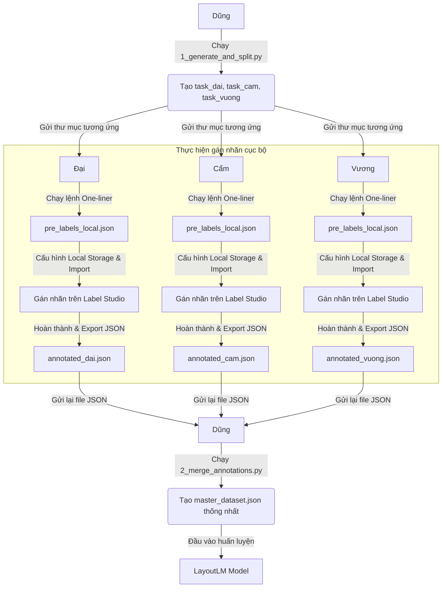

# Hướng Dẫn Quy Trình Gán Nhãn Bán Tự Động (AVIR-KIE)
**Dự án: Trích xuất thông tin hóa đơn tiếng Việt sử dụng OCR và LayoutLM**

Tài liệu này tổng hợp luồng công việc của cả nhóm (Dũng, Đại, Cẩm, Vương) từ lúc chuẩn bị dữ liệu, gán nhãn cục bộ, cho đến lúc gộp dữ liệu thành dataset hoàn chỉnh.

---

## 📊 1. SƠ ĐỒ LUỒNG CÔNG VIỆC



---

## 🛠️ 2. HƯỚNG DẪN CHI TIẾT CHO ĐẠI, CẨM, VƯƠNG

### **Bước 2.1: Nhận thư mục làm việc từ Dũng**
Mọi người nhận thư mục công việc tương ứng của mình:
* **Đại**: Thư mục `task_dai/`
* **Cẩm**: Thư mục `task_cam/`
* **Vương**: Thư mục `task_vuong/`

*(Thư mục chứa thư mục con `images/` và file nhãn mồi thô `pre_labels.json`)*

### **Bước 2.2: Khởi chạy Label Studio**
* **Trên Windows**:
  - Chỉ cần **click đúp vào file `run_label_studio.bat`** đi kèm. 
  - Script sẽ tự động kiểm tra Python, tự động cài đặt `label-studio` (nếu chưa có) và khởi chạy máy chủ phục vụ cục bộ.
* **Trên macOS / Linux**:
  - Cài đặt Label Studio: `pip3 install label-studio`
  - Khởi chạy máy chủ:
    ```bash
    export LABEL_STUDIO_LOCAL_FILES_SERVING_ENABLED=true
    label-studio
    ```

### **Bước 2.3: Cấu hình đường dẫn ảnh tuyệt đối**
Mở Terminal/PowerShell, di chuyển vào thư mục task của mình (ví dụ `task_dai/`) và chạy lệnh tương ứng để tạo file `pre_labels_local.json` chứa đường dẫn cục bộ trên máy mình:
* **Nếu dùng Windows (Chạy trên PowerShell)**:
  ```powershell
  python -c "import os, json; f='pre_labels.json'; d=json.load(open(f, encoding='utf-8')); [t['data'].update(image='/data/local-files/?d=' + os.path.abspath(t['data']['image']).replace('\\', '/')) for t in d]; json.dump(d, open('pre_labels_local.json', 'w', encoding='utf-8'), indent=2, ensure_ascii=False)"
  ```
* **Nếu dùng macOS / Linux (Chạy trên Terminal)**:
  ```bash
  python3 -c "import os, json; f='pre_labels.json'; d=json.load(open(f, encoding='utf-8')); [t['data'].update(image='/data/local-files/?d=' + os.path.abspath(t['data']['image'])) for t in d]; json.dump(d, open('pre_labels_local.json', 'w', encoding='utf-8'), indent=2, ensure_ascii=False)"
  ```

### **Bước 2.4: Tạo Dự án và Gán nhãn**
1. Truy cập trình duyệt web tại `http://localhost:8080` (đăng ký tài khoản email/mật khẩu bất kỳ nếu chạy lần đầu).
2. Tạo Project mới, đặt tên tùy ý. Tại tab **Labeling Setup**, chọn **Custom Template** (hoặc tab Code) và dán cấu hình XML dưới đây:
   ```xml
   <View>
     <Image name="image" value="$image"/>
     <RectangleLabels name="label" toName="image">
       <Label value="STORE_NAME" background="#FF4D4F"/>
       <Label value="ADDRESS" background="#40A9FF"/>
       <Label value="DATE" background="#73D13D"/>
       <Label value="TOTAL_AMOUNT" background="#FADB14"/>
       <Label value="ITEM_NAME" background="#FF85C0"/>
       <Label value="ITEM_PRICE" background="#FFC069"/>
       <Label value="ITEM_QTY" background="#95DE64"/>
       <Label value="ITEM_TOTAL" background="#B37FEB"/>
       <Label value="OTHER" background="#9254DE"/>
     </RectangleLabels>
     <TextArea name="transcription" toName="image" editable="true" perRegion="true" required="true" displayMode="region-list"/>
   </View>
   ```
3. Lưu Project.
4. Vào **Settings -> Cloud Storage -> Add Source Storage**:
   - **Storage Type**: Local Files
   - **Local Path**: Điền đường dẫn tuyệt đối đến thư mục `images/` của mình (Ví dụ: `C:/Users/Dai/DoAn/task_dai/images`).
   - Nhấn **Save Connection**. (**CHÚ Ý QUAN TRỌNG**: Tuyệt đối **KHÔNG** bấm nút "Sync" hay "Sync Storage").
5. Quay lại màn hình chính của Project, nhấn **Import** và tải file **`pre_labels_local.json`** lên. Bounding Box và chữ mồi sẽ xuất hiện ngay lập tức trên ảnh.
6. **Bắt đầu gán nhãn**:
   - Kiểm tra các Bounding Box đã được vẽ sẵn. Đổi nhãn tương ứng từ mặc định `OTHER` sang nhãn đúng:
     - `STORE_NAME`: Tên cửa hàng/siêu thị
     - `ADDRESS`: Địa chỉ
     - `DATE`: Ngày tháng xuất hóa đơn
     - `TOTAL_AMOUNT`: Tổng tiền thanh toán của cả hóa đơn (ở phần cuối)
     - `ITEM_NAME`: Tên mặt hàng/sản phẩm
     - `ITEM_PRICE`: Đơn giá của mặt hàng
     - `ITEM_QTY`: Số lượng hoặc trọng lượng (ví dụ: 3, 0.410KG)
     - `ITEM_TOTAL`: Thành tiền của mặt hàng đó (số lượng x đơn giá)
     - `OTHER`: Các thông tin phụ khác (thuế VAT, tiền thừa, lời cảm ơn, v.v.)
   - Nếu PaddleOCR nhận diện sai chính tả, sửa lại trực tiếp trong ô nhập liệu text bên phải của box đó.
   - Bấm **Submit** hoặc **Update** để lưu và chuyển sang ảnh tiếp theo.
### **Bước 2.5: Xuất kết quả gửi lại cho Dũng**
1. Nhấn nút **Export** ở màn hình chính của Project.
2. Chọn định dạng **JSON** (Không chọn JSON_MIN).
3. Đổi tên file tải về tương ứng:
   - Đại đổi tên thành: `annotated_dai.json`
   - Cẩm đổi tên thành: `annotated_cam.json`
   - Vương đổi tên thành: `annotated_vuong.json`
4. Gửi file JSON này lại cho Dũng.

---

## 🛠️ 3. HƯỚNG DẪN CHO DŨNG (GỘP KẾT QUẢ)

Sau khi nhận đủ 3 file JSON từ Đại, Cẩm, Vương:
1. Đặt các file `annotated_dai.json`, `annotated_cam.json`, `annotated_vuong.json` vào thư mục dự án (hoặc đặt trong thư mục task tương ứng của mỗi người).
2. Mở Terminal/PowerShell tại thư mục dự án và chạy:
   ```bash
   python 2_merge_annotations.py
   ```
3. Kết quả thu được là file `master_dataset.json` chứa toàn bộ dữ liệu sạch đã được quy đổi đường dẫn tương đối chuẩn cho LayoutLM.
